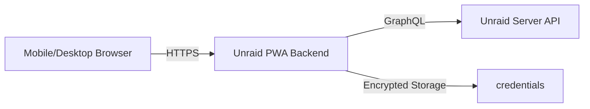

# Welcome to Unraid PWA

Unraid PWA is a **self-hostable, mobile-first Progressive Web Application** that lets you monitor and control your Unraid servers from any device. Built with a modern GraphQL API backend and a responsive React frontend, it provides a seamless experience whether you're at your desk or on the go.

## Key Features

<CardGroup cols={2}>
  <Card
    title="Real-time Monitoring"
    icon="chart-line"
    iconType="duotone"
  >
    Track server status, array health, storage usage, and system metrics in real-time from your mobile device or desktop.
  </Card>
  <Card
    title="Docker Management"
    icon="docker"
    iconType="duotone"
  >
    Start, stop, and restart Docker containers with a single tap. View container status and resource usage at a glance.
  </Card>
  <Card
    title="VM Control"
    icon="computer"
    iconType="duotone"
  >
    Manage virtual machines with support for start, stop, pause, resume, force stop, reboot, and reset operations.
  </Card>
  <Card
    title="Array Operations"
    icon="server"
    iconType="duotone"
  >
    Start and stop your Unraid array, monitor disk health, and view share information from anywhere.
  </Card>
  <Card
    title="Multi-Server Support"
    icon="network-wired"
    iconType="duotone"
  >
    Connect and manage multiple Unraid servers from a single interface. Switch between servers with ease.
  </Card>
  <Card
    title="Secure by Default"
    icon="shield-check"
    iconType="duotone"
  >
    Encrypted credential storage, CSRF protection, rate limiting, and audit logging keep your servers secure.
  </Card>
</CardGroup>

## Architecture Overview

Unraid PWA consists of two main components:

- **Frontend**: React-based PWA with offline support and mobile-optimized UI
- **Backend**: Node.js BFF (Backend for Frontend) that securely communicates with the Unraid GraphQL API

<Note>
  The backend acts as a secure proxy, handling authentication, encryption, and API communication so your Unraid credentials stay safe.
</Note>

## How It Works

1. You access the PWA from any browser at `http://<UNRAID-IP>:2442`
2. The backend securely stores your Unraid API credentials (encrypted at rest)
3. All API requests are proxied through the backend with CSRF protection
4. Real-time data is fetched from your Unraid server's GraphQL API

## Security Features

<CardGroup cols={2}>
  <Card title="Encrypted Credentials" icon="lock">
    Server credentials are encrypted using AES-256-GCM and stored in `backend/data/servers.enc`
  </Card>
  <Card title="CSRF Protection" icon="shield">
    All write operations require valid CSRF tokens to prevent cross-site attacks
  </Card>
  <Card title="Rate Limiting" icon="gauge">
    Write operations are rate-limited to prevent abuse and accidental resource exhaustion
  </Card>
  <Card title="Audit Logging" icon="file-lines">
    All write actions are logged to `backend/data/audit.log` for accountability
  </Card>
</CardGroup>

## What's Next?

<CardGroup cols={2}>
  <Card
    title="Installation Guide"
    icon="download"
    href="/installation"
  >
    Learn how to install Unraid PWA on your server using Docker Compose
  </Card>
  <Card
    title="Quick Start"
    icon="rocket"
    href="/quickstart"
  >
    Get up and running in 5 minutes with our step-by-step quick start guide
  </Card>
  <Card
    title="Configuration"
    icon="gear"
    href="/configuration"
  >
    Customize environment variables, CORS settings, and security options
  </Card>
  <Card
    title="API Reference"
    icon="code"
    href="/api/overview"
  >
    Explore the REST API endpoints for advanced integrations
  </Card>
</CardGroup>

## Requirements

<Info>
  Before installing, ensure you have:
  - Unraid 6.12+ with GraphQL API enabled
  - Docker and Docker Compose installed on your Unraid server
  - Network access to port 2442 (or your custom port)
</Info>

## Community & Support

Unraid PWA is open source and MIT licensed. Contributions, bug reports, and feature requests are welcome!

- **GitHub Repository**: [laurensguijt/Unraid-PWA](https://github.com/laurensguijt/Unraid-PWA)
- **Issues**: Report bugs or request features on GitHub Issues
- **License**: MIT